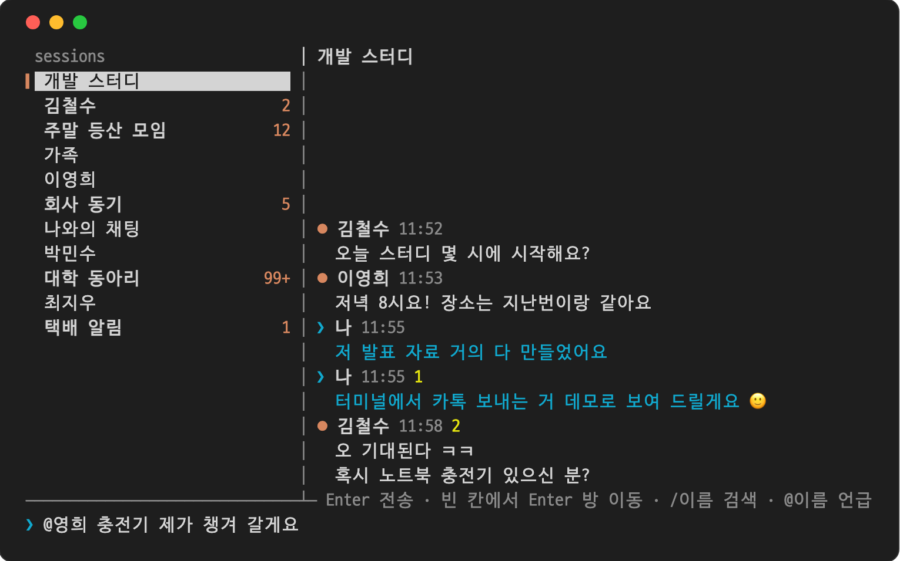

# nunchi 👀

> 눈치 보지 말고, 터미널에서 카톡하세요.

**nunchi**(눈치)는 macOS용 카카오톡을 터미널에서 쓰는 비공식 클라이언트입니다.
실행 중인 카카오톡 앱을 **손쉬운 사용(Accessibility) API**로 읽고 조작하므로, 카카오 서버와 직접 통신하지 않습니다.



## 기능

- 왼쪽에 채팅방 목록(안 읽은 메시지 수 포함), 오른쪽에 대화가 보이는 분할 화면
- 메시지 읽기·보내기, 메시지별 안 읽은 사람 수 표시
- `@이름`으로 단톡방 언급 (Tab 자동 완성)
- `/이름`으로 전체 채팅방 검색
- 카카오톡 변경 알림을 받아 새 메시지를 바로 반영
- 채팅방 창 위치 기억 (처음엔 카카오톡 메인 창 옆에 열림)

## 요구 사항

- macOS (Swift 컴파일러 포함, Xcode Command Line Tools)
- macOS용 카카오톡이 실행 중이고 로그인되어 있어야 합니다
- 확인한 환경: **카카오톡 26.8.0, macOS 26.6.2**

## 설치

```sh
git clone https://github.com/seo-minki/nunchi.git
cd nunchi
./install.sh   # 빌드한 뒤 /usr/local/bin/nunchi 로 설치합니다 (관리자 비밀번호를 물어볼 수 있습니다)
```

- 다른 곳에 설치하려면 `PREFIX=~/.local ./install.sh`처럼 경로를 지정하세요. 그 폴더의 `bin`이 PATH에 있어야 합니다.
- 설치 없이 저장소 폴더에서 `./build.sh` 후 `./nunchi`로 실행해도 됩니다.
- 지우려면 `./install.sh --remove`를 실행하세요.

처음 실행하기 전에 **시스템 설정 > 개인정보 보호 및 보안 > 손쉬운 사용**에서 사용하는 터미널 앱(Terminal, iTerm, Ghostty 등)을 켜 주세요.

## 업데이트

```sh
nunchi --update
```

- 설치할 때 기억해 둔 저장소 폴더에서 최신 코드를 받아(`git pull`) 다시 빌드·설치합니다.
- `nunchi`를 실행하면 하루에 한 번 GitHub에 새 버전이 있는지 확인하고, 있으면 화면 위쪽에 알려 줍니다. 버전 번호만 확인하며 카카오톡 데이터는 보내지 않습니다. 끄려면 `NUNCHI_NO_UPDATE_CHECK=1`을 설정하세요.

**v0.5.2 이하를 쓰고 있다면** `--update`가 없거나 제대로 동작하지 않으니, 클론한 폴더에서 한 번만 직접 업데이트해 주세요.

```sh
cd nunchi
git pull
./install.sh
```

## 사용법

```sh
nunchi
```

| 키 | 동작 |
|---|---|
| ↑ ↓ | 채팅방 고르기 |
| Enter (입력창이 비었을 때) | 고른 채팅방 열기 |
| 글 입력 후 Enter | 열린 채팅방으로 전송 |
| `/이름` 후 Enter | 채팅방 검색해서 열기 |
| `@이름` | 언급 (Tab으로 자동 완성) |
| Shift+↑ / Shift+↓ | 대화 위아래로 3줄씩 스크롤 |
| PageUp / PageDown (fn+↑ / fn+↓) | 대화 반 화면씩 스크롤 |
| End (fn+→) | 대화 맨 아래로 |
| Esc | 채팅방 닫기 (더 이상 읽음 처리되지 않음) |
| Ctrl+O | 카카오톡 채팅방 창을 맨 앞으로 (사진 볼 때) |
| Ctrl+U | 입력줄 지우기 |
| `/?` 후 Enter | 단축키 목록 보기 (`/도움말`도 됨) |
| Ctrl+C | 종료 |

- 채팅방을 열어 두면 카카오톡이 새 메시지를 바로 읽음 처리합니다. 그래서 **2분 동안 키 입력이 없으면 방을 자동으로 닫습니다.** `NUNCHI_IDLE=300 nunchi`처럼 초 단위로 바꿀 수 있고, `0`이면 끕니다.
- 방을 열기 전에는 고른 방의 **마지막 메시지를 엿볼 수 있습니다.** 목록에서 읽는 것이라 읽음 처리되지 않습니다.

`nunchi --demo`를 실행하면 카카오톡 없이 가짜 데이터로 화면을 한 번 그려 볼 수 있습니다. 위 스크린샷도 이렇게 만들었습니다.

카카오톡 창은 터미널 뒤에 가려 두어도 동작합니다. 카카오톡을 Cmd+H로 가려 둔 상태에서도 읽기와 보내기가 됩니다.

## 동작 원리

- **읽기**: macOS의 손쉬운 사용 API로 카카오톡 창의 화면 구조(채팅방 목록 표, 메시지 행, 입력창)를 읽습니다.
- **보내기·방 열기**: 입력창에 포커스를 준 뒤 키보드 이벤트로 글자를 입력하고 Enter를 보냅니다. 방을 열 때는 목록에서 그 방이 실제로 선택됐는지 확인한 뒤에만 Enter를 보냅니다.
- **새 메시지 감지**: 카카오톡이 보내는 접근성 변경 알림(AXObserver)을 받아 바로 새로고침하고, 3초마다 한 번씩도 확인합니다.
- **속도**: 카카오톡은 접근성 요청 하나에 약 10ms가 걸려서, 여러 속성을 한 번에 가져오고 바뀐 부분이 있을 때만 다시 읽습니다.

## 한계

- 카카오톡 앱이 켜져 있어야 합니다. 방을 열면 카카오톡에서도 읽음 처리됩니다.
- 방을 처음 열면 카카오톡이 불러 둔 최근 메시지(대략 20~50개)부터 보입니다. 방을 열어 둔 동안 새로 온 메시지는 최근 500개까지 쌓여서 스크롤로 볼 수 있습니다.
- 사진·이모티콘은 `[사진/이모티콘]`으로만 표시되고, 이모티콘·사진·파일 보내기와 답장은 지원하지 않습니다.
- 카카오톡 내부 화면 구조에 의존하므로, 카카오톡이 업데이트되면 동작하지 않을 수 있습니다.
- 카카오톡 채팅방 창이 최소화되어 있으면 보낼 때 창이 다시 올라옵니다.

## 면책

이 프로젝트는 카카오와 관련이 없는 **비공식** 개인 프로젝트입니다.
카카오톡 이용약관을 확인하고 본인 책임 아래 사용해 주세요. 사용으로 생기는 계정 제재 등 어떤 문제에도 책임지지 않습니다.

## 변경 이력

### v0.5.4 (2026-10-06)
- 긴 링크가 여러 줄로 나뉘면 첫 줄만 클릭되던 문제 수정. 이제 어느 줄을 눌러도 전체 주소로 열립니다 (OSC 8 링크)
- `naver.me/abc`처럼 `https://` 없이 온 주소도 링크로 표시

### v0.5.3 (2026-10-06)
- `nunchi --update` 중 관리자 비밀번호가 평문으로 보이고 업데이트가 실패하던 문제 수정
  - v0.5.0~v0.5.2에서는 `--update`가 이 문제로 실패할 수 있으니, 클론한 폴더에서 `git pull && ./install.sh`로 한 번 업데이트해 주세요.
- 관리자 비밀번호가 필요할 때 미리 안내

### v0.5.2 (2026-10-06)
- `❤️` `✔️` `1️⃣`처럼 이모지 변형 기호가 붙은 문자의 폭을 잘못 계산해 줄 끝 글자가 잘리거나 밀리던 문제 수정
- 한글 조합 중에 Enter를 누르면 마지막 글자가 빠질 수 있던 문제 대비

### v0.5.1 (2026-10-02)
- 카카오톡 시간이 12시간제(`오후 3:05`, `3:05 PM`)로 표시되는 환경에서 시간이 이름 옆이 아니라 본문으로 떨어져 나오던 문제 수정

### v0.5.0 (2026-10-02)
- 2분 동안 입력이 없으면 채팅방을 자동으로 닫아 읽음 처리 멈추기 (`NUNCHI_IDLE`로 조절)
- 방을 열기 전에 고른 방의 마지막 메시지 엿보기 (읽음 처리 안 됨)
- 메시지가 빠르게 오는 방에서 기억해 둔 이전 대화가 사라지던 문제 수정
- `nunchi --version`, `nunchi --update`(최신 버전 받아 다시 설치), 새 버전 알림

### v0.4.0 (2026-10-01)
- 대화 칸 스크롤 (Shift+↑↓, PageUp/PageDown, End). 위로 올려 보는 동안 새 메시지가 와도 위치 유지
- `/?`로 단축키 목록 보기, 첫 화면에 단축키 표시, 아래 안내 줄 짧게 정리
- `/이름` 검색을 실행 직후에도 바로 쓸 수 있게 개선

### v0.3.0 (2026-10-01)
- 이름 변경: `kakaotalk-tui` → **nunchi**, 명령어 `kt` → `nunchi`
- README 데모 스크린샷, `--demo` 모드

### v0.2.0 (2026-10-01)
- Esc로 채팅방을 바로 닫기 (새로고침 중이면 1~2초 늦던 문제 수정)
- 카카오톡 메인 창이 친구·더보기 탭이어도 채팅 탭으로 돌려놓고 목록 읽기
- `install.sh`로 설치·삭제

### v0.1.0 (2026-10-01) 첫 공개
- 채팅방 목록과 대화를 나눠 보는 분할 화면, 메시지 읽기·보내기
- 메시지별 안 읽은 사람 수, 단톡방 `@이름` 언급(Tab 자동 완성), `/이름` 검색
- 카카오톡 변경 알림으로 새 메시지 즉시 반영, 연달아 온 메시지·화면 밖 메시지 이어 붙이기
- 채팅방 창 위치 기억, Ctrl+O로 카카오톡 창 앞으로
- AI 에이전트용 `AGENTS.md`

## 라이선스

[MIT](LICENSE)
